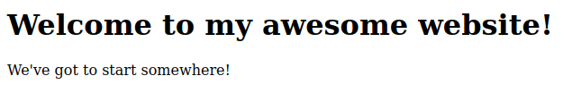

# HTML Tutorial: How To Build Cool Websites

*This tutorial was created by Dylan Rogers. It is owned and managed by [**The Open Project**](https://youtube.com/@open-project) and any attempt to redistribute or use this content must follow the [licence](#licence). Find out more at [123web](http://123web.uk)*

## Contents

[Home](#html-tutorial-how-to-build-cool-websites)  
[Licence](#licence)

[Chapter 1: Your First Website]

## Licence

<!-- **This content is a fork of the original by Dylan Rogers. Please abide by the licence.** (uncomment this line if your document is a fork of my document) -->

If you are *not* redistributing this file (in other words, you are just a reader and this tutorial will stay on your computer, you will not send it to anyone):

* You may use the skills learned in this tutorial for personal, commercial or non-commercial projects
* As long as you do not share this tutorial, you may use it however you would like to.
* If you share the document, you are obliged to follow the rules below.

If you are a content/tutorial maker and would like to share this tutorial with others:

* You may **only** distribute this file amongst your audience (e.g. download links to this tutorial) if you give *reasonable credit* showing that this document was created by Dylan Rogers. *Reasonable credit* is defined as a message that cannot be missed, such as mentioning it when the content is on-screen (for videos), or adding a note in the main content section (for books).
* You must include this licence in all distributed versions.

If you fork and redistribute your own version of this:

* You must give credit that your version of the document is a fork of Dylan Rogers' original.
* You may share your content commercially or non-commercially, provided credit is given.
* You must include this licence in all publicly available versions.
* You must uncomment the comment at the beginning of this licence.
* The content must be correct - you must not **intentionally** provide misinformation (it's fine to make a few accidental mistakes, as long as you fix any problems when prompted).

General information:

* All code is free to use for both commercial and non-commercial products, no credit required.
* Any forks of this file should credit Dylan Rogers

Credited links:

[Video tutorials are available here](https://www.youtube.com/@dylancode)  
[Dylan's YouTube channel](https://youtube.com/@dylancode)  
[Dylan's github](https://github.com/DylanRogers1)  

[Back to contents](#contents)

# Chapter 1: Your First Website

This tutorial is going to be a little different to the others. Instead of grouping a lot of information into each chapter, I'm going to aim to dedicate each (short) chapter to a specific HTML tag.

In this chapter, I want us to create our first website! We'll go over what it all means in later chapters, but for now we'll just focus on the code!

First, create a new file with the `.html` extension. I'll call my file `awesome-website.html`. Open your file in a text editor such as VS Code and type the following code:

[first-website > awesome-website.html](code/first-website/awesome-website.html)

``` html
<!DOCTYPE html>
<html>
  <head>
    <title>My Awesome Website</title>
  </head>
  <body>
    <h1>Welcome to my awesome website!</h1>
    <p>We've got to start somewhere!</p>
  </body>
</html>
```

There you go - your first website! If you open it in a web browser, you can see the following result:



> Don't worry if you don't understand the code at the moment. We'll go through it in the following chapters.

# Chapter 2: `<!DOCTYPE>`

> `<!DOCTYPE>` isn't technically a tag, because it doesn't have a closing tag. We can still consider it a tag though, so let's go through it!

Something that will always appear at the top of your HTML website is the `<!DOCTYPE>` tag. This tag just specifies that the current file we are viewing is an HTML file. Without it, some web browsers will not display the site properly.

We can specify the type of document we are creating by adding a language name after `!DOCTYPE`. We will almost always want to specify HTML, so for now just know that the `<!DOCTYPE>` tag always appears as `<!DOCTYPE html>`.

# Chapter 3: `<html>`

The `<html>` tag is used to declare the root of an HTML file.

Everything goes inside the `<html>` tag, as it just declares the body of HTML content.
